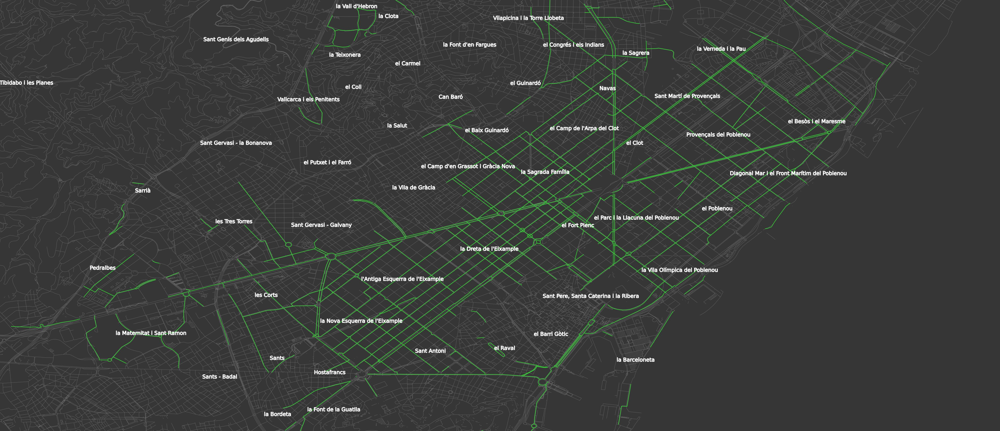
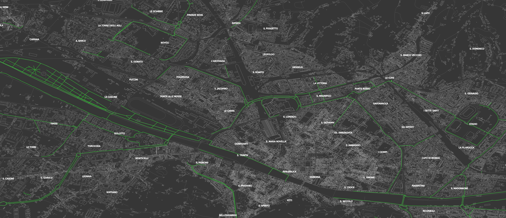

# Mapnik Maps

Creating maps in my (very few) spare time.

Trees and bikeways for Barcelona and Firenze. 
Which is the greener?? 

    

        
        
Trees in BCN

    

    

        
        
Bike Roads in BCN

    

    

        
        
Trees in Florence

    

    

        
        
Bike Roads in Florence

    

<!-- Image overlay -->

    <button class="close-btn" onclick="closeOverlay()">×</button>
    
    

