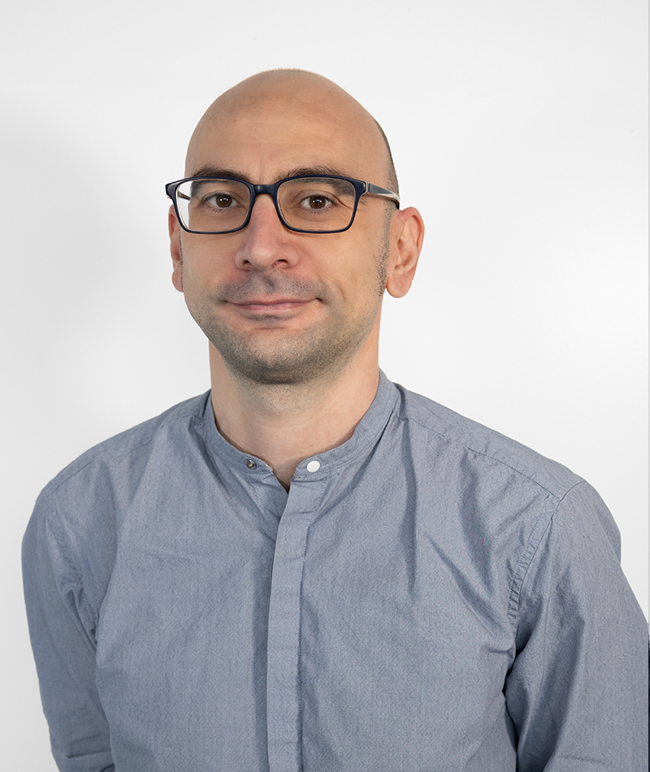

# About me

{ width=200 }

Luca Vettori is a Telecommunications Engineer with extensive R&D and software development experience (10+ years), based in Barcelona (Spain).
  
He obtained his Telecommunication Engineering Degree from the University of Florence (UNIFI), Italy in 2008. He also has a master's degree in Applied Telecommunication and Engineering Management from the University of Catalonia (UPC), earned in 2017.
Currently, he is pursuing a PhD in Signal Theory and Communications at UPC, focusing on <strong>
Optical SDN, Network Virtualization, and Orchestration</strong>.
  
Throughout his professional career, he has worked in both industry and research academia, taking on various roles. He worked as a Network Engineer for an Italian telephone company from 2011 to 2012, and in Spain as a Support and Software Engineer before joining <a href="https://www.cttc.cat/people/luca-vettori/" target="_blank">CTTC</a> in 2017 as a <strong><i>Researcher and Software Engineer</i></strong>.

## Resume

<a href="/resources/Luca-Vettori-MSc-20250725.pdf" target="_blank">View my resume</a>
